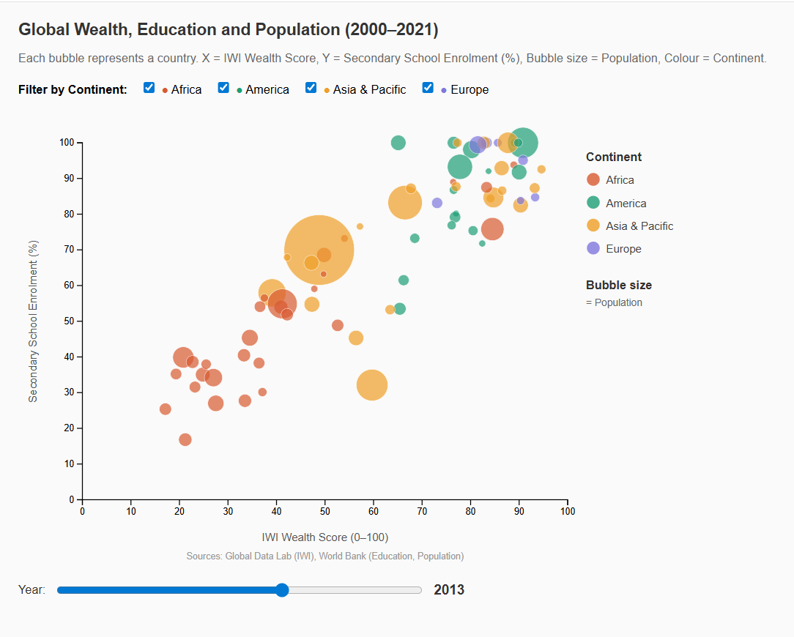

# Global Wealth, Education and Population: D3 Interactive Visualisation

## Overview

This project explores the relationship between national wealth, education and 
population across 126 countries from 2000 to 2021. In the current global 
geopolitical scenario, understanding how wealth and education co-evolve across 
different economies is increasingly relevant, especially when population size 
is considered, since a small wealthy country achieving 90% school enrolment 
tells a very different story to a large country achieving the same figure.

The project uses three datasets: the International Wealth Index (IWI) from 
Global Data Lab, World Bank education statistics, and World Bank population 
data, merged into a clean dataset of 1,504 rows. The main output is an 
interactive D3.js bubble chart where each bubble represents a country, 
position encodes wealth and education, bubble size encodes population, and 
colour encodes continent. A year slider animates 22 years of change, revealing 
how the wealth-education relationship evolved globally between 2000 and 2021.

Key findings include a strong positive correlation between wealth and education 
(r=0.876), dramatic improvement in low income countries over the 22-year period, 
and the surprising result that government education spending does not reliably 
predict future wealth growth, suggesting education improvement is more a 
byproduct of economic growth than a driver of it.

## Live Demo
[View the interactive chart here](https://saumya-jaiswal.github.io/global-development-explorer-d3/)

## Research Questions
- Q1: Analyse the relation between wealth and education. Are there detectable trends?
- Q2: Does government investment in education drive future wealth growth?
- Q3: Are low-income countries catching up with wealthier nations over time?

## How to Run
1. Clone the repository
2. Navigate to the project folder
3. Run: `python -m http.server 8000`
4. Open Chrome and go to: `http://localhost:8000/index.html`

## Features
- Animated bubble chart across 126 countries (2000–2021)
- Year slider with smooth transitions
- Hover tooltips showing country details
- Continent filter with animated exit

## Data Sources
- [International Wealth Index — Global Data Lab](https://globaldatalab.org/wealth/table/iwi/)
- [World Education Data — World Bank via Kaggle](https://www.kaggle.com/datasets/bushraqurban/world-education-dataset/data)
- [Population Data — World Bank](https://data.worldbank.org/indicator/SP.POP.TOTL)

## Technologies
- D3.js v7
- HTML, CSS, JavaScript
- Python (data preprocessing)

## Acknowledgements
D3 bubble chart adapted from [D3 Graph Gallery](https://d3-graph-gallery.com/bubble.html) by Yan Holtz.
Data exploration assisted by AI tools.
